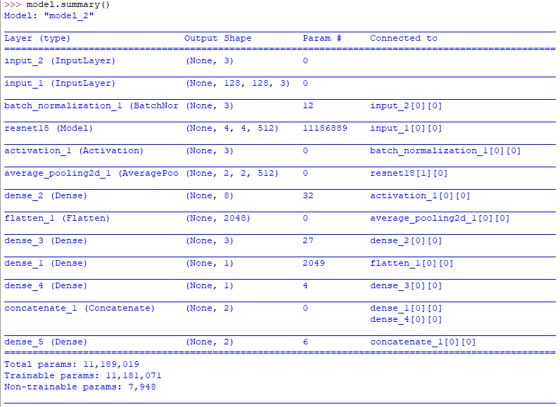

# face-anti-spoofing
Pretrained model for face anti-spoofing or face liveness detection problem.

This is a Keras based model to detect face anti-spoofing. 
The videos used for training are splitted into frames. These frames are in RGB and they are passed to a ResNet18 model. Also rPPG features are extracted from these frames and passed to a Dense layer. These two models are then merged together.

The model basically consists of two branches. The first branch processes the input images as they are, by passing them through ResNet18 network. The second branch extracts rPPG features from the images and pass them through Dense layer. The outputs of the two branches are concatenated then sent to the final classification layer.

The file `test_mdoel.py` is for testing the pretrained model using live photos from webcam. Face is detected and the frame with rPPG are passed to the model and the prediction result is calculated. 
The result of a list of frames are buffered (the length of the buffer is determined in the variable called **frames_buffer** ) and if the sum of the prediction results reached an acceptable value (as in **accepted_falses** variable) it announces result accordingly (real/spoof)   [*Note that 0 indicates real and 1 indicates spoof*]

# Credits:
- The faces are detected using "haarcascade_frontalface_default.xml".
- The ResNet18 model is from https://github.com/qubvel/classification_models
- The rPPG signal calculations are from https://github.com/MartinChristiaan/PythonVideoPulserate
